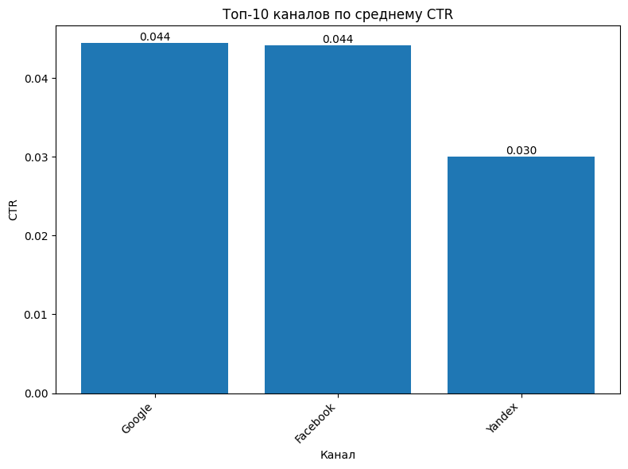

# ETL Pipeline: Sales & Ads Metrics

## Описание
Проект реализует ETL (Extract-Transform-Load) для ежедневных продаж и рекламных метрик. 
Скрипт `etl.py` выполняет:

- **Extract**: чтение и валидацию CSV-файлов `sales.csv` и `ads.csv`.
- **Transform**: расчет uplift по промо/не промо, CTR, CPC, поиск аномалий по median ± IQR.
- **Load**: сохранение результатов в SQLite, Parquet, генерация отчета `report.md` с топ-10 аномалий.

Дополнительно:
- Мини-графики по топ-каналам CTR.
- Поддержка LLM для краткого анализа аномалий через флаг `--explain`.

## Настройка

### 1. Создайте `.env` (если еще не создан) на основе `.env.example`:
`USE_LLM=0`

`MODEL_NAME=stub`

`DB_URL=sqlite:///./etl.db`

### 2. Установите зависимости:
`pip install -r requirements.txt`

## Запуск

### Отдельные шаги ETL
- `python etl.py extract`

- `python etl.py transform`

- `python etl.py load`

### Полный запуск 
`python etl.py run_all`

### Полный запуск (LLM используется по умолчанию)
`python etl.py run_all --explain`

## Запуск тестов

### Валидация данных 
`pytest tests/test_validation.py -q`

### Бизнес-логика
`pytest tests/test_uplift_and_iqr_basics.py -q`

### Интеграция компонентов
`pytest tests/test_integration.py -q`

### Запуск всех тестов
`pytest tests/ -q`

## Данные

Проект использует два исходных CSV-файла в папке `data/`:

- `sales.csv` — данные по продажам:
  - `date` — дата продажи
  - `store_id` — идентификатор магазина
  - `sku_id` — идентификатор товара
  - `promo_flag` — флаг промо-акции (0/1)
  - `units` — количество проданных единиц
  - `revenue` — выручка за продажу

- `ads.csv` — данные по рекламным кампаниям:
  - `date` — дата показов
  - `channel` — рекламный канал
  - `campaign_id` — идентификатор кампании
  - `impressions` — количество показов
  - `clicks` — количество кликов
  - `cost` — затраты на кампанию

## Вывод результатов

### После успешного выполнения ETL вы получите:

- **База данных SQLite**:
    - `etl.db` (расположена в корне проекта) с таблицами:
       - `uplift_by_store` — результаты расчёта uplift по магазинам
       - `ads_metrics` — CTR, CPC и суммарные метрики по каналам
       - `anomalies` — все найденные аномалии по CTR/CPC

- **Файлы Parquet/CSV (файлы .parquet создаются, если установлен pyarrow, иначе сохраняется .csv)**:
    - `output/uplift_by_store.parquet`
    - `output/ads_metrics.parquet`
    - `output/anomalies.parquet`
  

- **Отчёт**:
    - `reports/report.md` — сводка с топ-10 аномалий и таблицей uplift
    - `reports/top_channels_ctr.png` — график топ-10 каналов по CTR (если установлен matplotlib)

### Пример графика 

### Пример report.md

## Автоматический запуск с помощью cron

### 1. Открываем crontab:

`crontab -e`

### 2. Добавляем задачу для ежедневного запуска в 02:00 (например):

`0 2 * * * cd /путь/к/проекту && /usr/bin/python3 etl.py run_all --explain`
